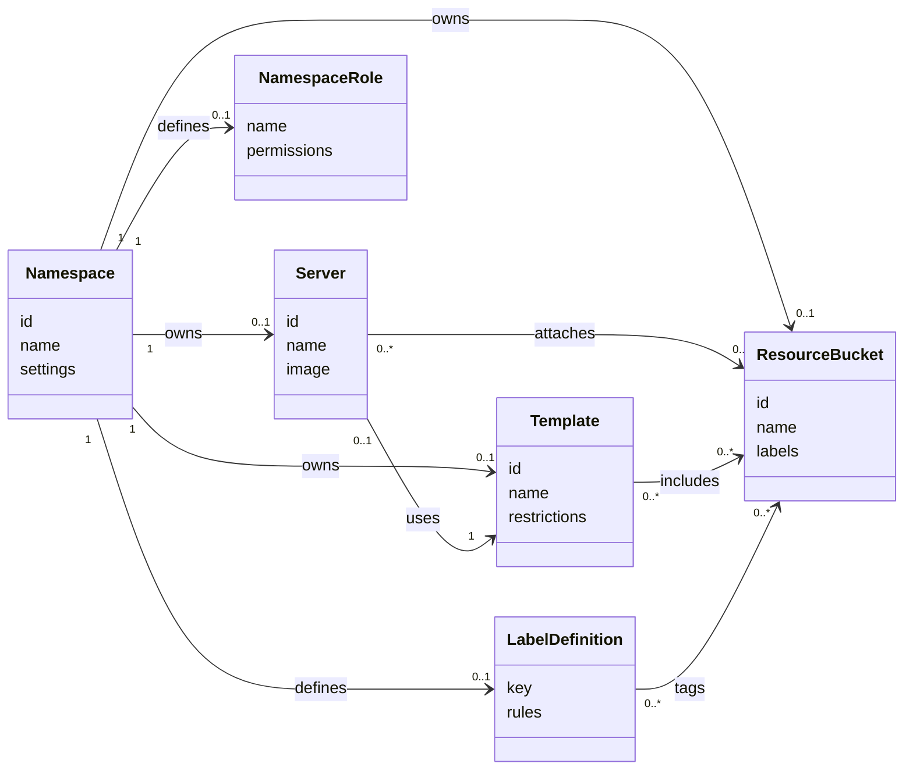
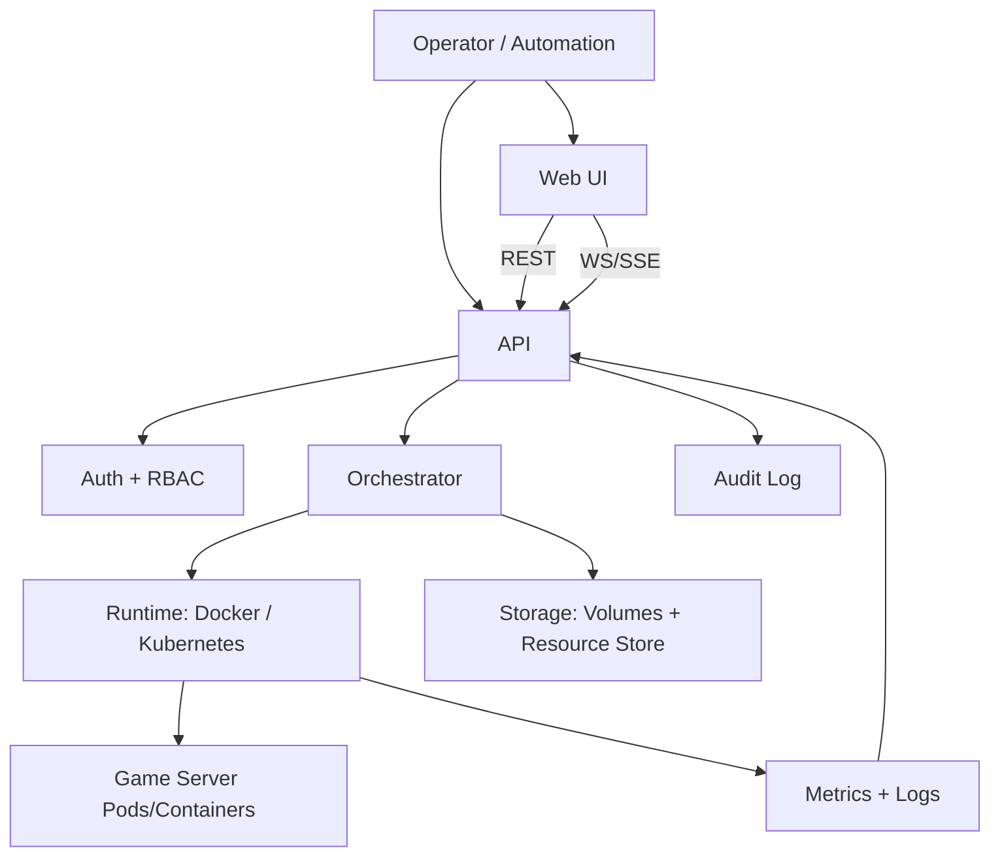

# server-orchestrator Concept

## Purpose
server-orchestrator is a central platform (web UI + API) to operate containerized game server infrastructure, starting with Minecraft. It provides multi-tenant management, repeatable templates, and controlled file/resource workflows for teams running multiple servers within a network.

## Goals
- Centralized management for server lifecycles, configuration, and assets.
- Clear tenant boundaries using namespaces with self-managed RBAC.
- Repeatable, restricted server templates for safe delegation.
- Unified UI and API for operators and automation.
- Kubernetes-first architecture with Docker support for small deployments.

## Core Capabilities
- Namespaces (tenants): represent server networks (for example, a Minecraft network consisting of multiple servers).
- Servers: concrete deployments such as "lobby-1" or "proxy-1"; each server belongs to exactly one namespace.
- Labels: keys that categorize servers/resources (for example, "proxy", "lobby", "modded", "plugin).
- Resources: shared assets (files, mods, plugins, configs) organized in namespace buckets.
- Templates: predefined server blueprints with optional RBAC restrictions.
- Role-based access control (RBAC) at namespace level. Server access control with restrictions on what users can change and which resources can be attached.
- UI + API: a consistent control surface for operators and external tools such as Minecraft in-game integrations.
- UI: Integrated file manager and code editor.

## Domain Model

### Namespace
- Top-level tenant boundary and ownership unit.
- Holds: servers, templates, labels, resource pools, and namespace roles.
- Has configurable limits and settings (quotas, allowed images, feature flags).

### Server
- Single namespace membership (mandatory).
- Backed by a container workload and persistent volume.
- Has labels, assigned template (optional), and attached resource bucket(s).

### Label Definition
- Declared per namespace.
- Used to classify servers and resources and drive template restrictions.
- Can be mapped to folder paths for controlled file placement.

### Resource Bucket
- Logical grouping of shared assets.
- Can be attached to servers or templates.
- Optional labels to control template restrictions.

### Template
- Blueprint describing image, resources, environment, and startup command.
- Restrictions define which settings are editable and which labels/resources are allowed.
- Can enforce label-to-folder mapping rules (example: only label "proxy" can write to `plugins/proxy/`).

### Roles and Permissions
- Global roles: user and admin.
- Namespace roles: self-defined and scoped to the namespace with permissions such as:
    - View files
    - Edit files
    - Edit config values
    - Create templates
    - Use templates
    - Create labels
    - Manage servers

## Access Control and Audit
- Every API operation is permission-checked at global and namespace levels.
- File operations and edits are gated by namespace role permissions.
- All changes are recorded in an audit log with actor, timestamp, and action details.

## File Management and Editor
- Web-based file manager for upload, download, and structured browsing.
- Integrated code editor with safe write paths and permission checks.
- Optional FTP/FTPS access per server with scoped credentials (namespace-controlled).

## Architecture
### Web UI
- Single-page application with namespace dashboard, server details, stats, and files.
- Live status and console streaming via WebSocket/SSE.

### API
- REST endpoints for all CRUD operations and server actions.
- WebSocket/SSE for live logs, console, and metrics.
- Token-based authentication for automation.

### Orchestrator (Control Plane)
- Translates user intent into container runtime resources.
- Reconciles desired state with actual state.
- Enforces template restrictions and RBAC policies.

### Runtime
- Containerized servers on Docker or Kubernetes.
- Persistent volumes for server data.
- Resource attachments applied on create or restart.

### Storage
- Per-server volume for runtime data.
- Shared resource store for assets and template bundles.
- Optional versioning for template and resource bundles.

### Observability
- Metrics: CPU, memory, disk, network, player stats (where available).
- Logs and events per server and per namespace.
- Health endpoints for control plane services.

### Architecture Overview Diagram

## Deployment Modes
- Kubernetes (production): primary target with strong isolation and scaling.
- Docker (small-scale): local dev and small deployments using docker-compose or a single host.

## Security and Compliance
- Principle of least privilege for all user actions.
- Secrets stored encrypted; sensitive values never shown unless explicitly permitted.
- Network policies to isolate namespaces and server classes.
- Backups and retention policies for volumes and resource storage.

## Success Criteria
- Operators can safely delegate server creation through templates.
- Namespaces provide isolation and self-managed RBAC without admin intervention.
- UI and API provide full coverage of the server lifecycle and file workflows.
- Kubernetes deployment remains stable under multi-server load with observable metrics.
